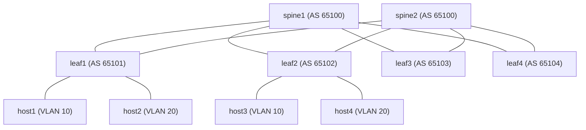

# Arista EVPN-VXLAN on Containerlab (cEOS)

> **Work in progress.** The topology, addressing and host layout are still changing.

A 2-spine, 4-leaf EVPN-VXLAN fabric on **Arista cEOS 4.32.0F**, defined as code and
run in [Containerlab](https://containerlab.dev). It is the container-based successor
to the [EVE-NG build](../arista/README.md): same ASN layout and VNI mapping, but the
whole fabric deploys, tears down and rebuilds from one topology file in about five
minutes, which is what the chaos scenarios in this repo need.

## Topology

Every leaf connects to both spines.



| Node   | Loopback0   | ASN   | Ports |
|--------|-------------|-------|-------|
| spine1 | 10.0.0.1/32 | 65100 | eth1-eth4 to leaf1-leaf4 |
| spine2 | 10.0.0.2/32 | 65100 | eth1-eth4 to leaf1-leaf4 |
| leaf1  | 10.0.0.11/32 | 65101 | eth1 to spine1, eth2 to spine2 |
| leaf2  | 10.0.0.12/32 | 65102 | eth1 to spine1, eth2 to spine2 |
| leaf3  | 10.0.0.13/32 | 65103 | eth1 to spine1, eth2 to spine2 |
| leaf4  | 10.0.0.14/32 | 65104 | eth1 to spine1, eth2 to spine2 |

## Underlay

Eight routed point-to-point /30 links, eBGP on every link, loopbacks advertised with
`network` statements. Link *k* uses `10.1.1.(4k)/30` with the spine on `.1` and the leaf
on `.2`; spine1 takes links 0-3 (leaf1-leaf4) and spine2 takes links 4-7. For example,
leaf3 to spine1 is `10.1.1.8/30` and leaf3 to spine2 is `10.1.1.24/30`.
Leaves run `maximum-paths 2`, so every remote loopback has two equal-cost paths.

## Overlay

| VLAN | VNI   | Route-target | Hosts |
|------|-------|--------------|-------|
| 10   | 10010 | 10010:10010  | host1 (leaf1), host3 (leaf2) |
| 20   | 10020 | 10020:10020  | host2 (leaf1), host4 (leaf2) |

- EVPN address family between each leaf and both spines. The spines relay routes and
  use `next-hop-unchanged`, so the leaf loopbacks stay the VXLAN tunnel endpoints.
- Flooding uses EVPN type-3 (IMET) routes, not static flood lists.
- VLAN-aware BGP with a per-VLAN RD of `<loopback>:<vni>`.

This is **Layer 2 EVPN-VXLAN stretch**. Inter-VLAN routing (SVIs, a VRF, an L3 VNI and
an anycast gateway) is the next step and is not configured yet.

## Hosts

Four lightweight Alpine containers with fixed MACs: two on leaf1 and two on leaf2, one
per VLAN on each (`eth3` is the VLAN 10 port and `eth4` is the VLAN 20 port):

| Host  | Leaf  | Port | VLAN | Address        |
|-------|-------|------|------|----------------|
| host1 | leaf1 | eth3 | 10   | 10.10.10.11/24 |
| host2 | leaf1 | eth4 | 20   | 10.20.20.11/24 |
| host3 | leaf2 | eth3 | 10   | 10.10.10.12/24 |
| host4 | leaf2 | eth4 | 20   | 10.20.20.20/24 |

leaf3 and leaf4 have no hosts yet. `host5` to `host8` for them are in the topology file,
commented out; uncomment a host and its link to attach it. The hosts have no SSH server,
so use `docker exec -it clab-arista-evpn-host1 sh` to get a shell.

## Run it

Needs a Linux host with Docker and Containerlab, and the cEOS image loaded as
`ceos:4.32.0F`. The image is a licensed download from Arista and is not in this repo.

```bash
containerlab deploy -t topology.clab.yml     # cEOS nodes boot 45s apart, ~4 min in total
containerlab inspect -t topology.clab.yml    # nodes and management IPs
ssh admin@clab-arista-evpn-leaf1             # lab login: admin / admin
containerlab destroy -t topology.clab.yml
```

Boots are staggered with `startup-delay` because starting every cEOS node at once spikes
the host CPU. Allow another minute after the last node starts for BGP to converge.

## Verify

```
show ip bgp summary                 # underlay: 2 sessions per leaf, 4 per spine
show ip route 10.0.0.14/32          # two equal-cost paths via the spines
show bgp evpn summary               # overlay sessions established
show vxlan vtep                     # the other leaves' loopbacks
show vxlan address-table            # MACs learned over VXLAN
```

From the host running the lab:

```bash
docker exec clab-arista-evpn-host1 ping -c 3 10.10.10.12   # VLAN 10, leaf1 to leaf2
docker exec clab-arista-evpn-host2 ping -c 3 10.20.20.20   # VLAN 20, leaf1 to leaf2
```

Hosts in different VLANs cannot reach each other yet; that needs the L3 step below.

## Status

- **Verified** on an earlier run of this fabric with two hosts per leaf (8 hosts):
  all underlay and EVPN sessions established, each leaf saw the three remote VTEPs,
  loopbacks had two equal-cost paths, and pings across leaves in VLAN 10 and VLAN 20
  had 0% loss.
- **Work in progress:** the layout above (four hosts on leaf1 and leaf2) is under active
  testing, and the results listed above are from the earlier two-hosts-per-leaf run.
- **Not done:** symmetric IRB (L3), and chaos scenarios against this fabric.

The `admin` / `admin` login in the switch configs is the Containerlab default for a
throwaway lab, not a recommendation.
