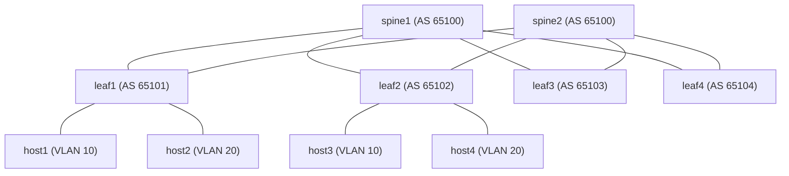

# Arista EVPN-VXLAN on Containerlab (cEOS)

> **Work in progress.** The topology, addressing and host layout are still changing.

A 2-spine, 4-leaf EVPN-VXLAN fabric on **Arista cEOS 4.32.0F**, defined as code and
run in [Containerlab](https://containerlab.dev). It is the container-based successor
to the [EVE-NG build](../arista/README.md): same ASN layout and VNI mapping, but the
whole fabric deploys, tears down and rebuilds from one topology file in about five
minutes, which is what the chaos scenarios in this repo need.

## Topology

Every leaf connects to both spines.



| Node   | Loopback0   | ASN   | Ports |
|--------|-------------|-------|-------|
| spine1 | 10.0.0.1/32 | 65100 | eth1-eth4 to leaf1-leaf4 |
| spine2 | 10.0.0.2/32 | 65100 | eth1-eth4 to leaf1-leaf4 |
| leaf1  | 10.0.0.11/32 | 65101 | eth1 to spine1, eth2 to spine2 |
| leaf2  | 10.0.0.12/32 | 65102 | eth1 to spine1, eth2 to spine2 |
| leaf3  | 10.0.0.13/32 | 65103 | eth1 to spine1, eth2 to spine2 |
| leaf4  | 10.0.0.14/32 | 65104 | eth1 to spine1, eth2 to spine2 |

## Underlay

Eight routed point-to-point /30 links, eBGP on every link, loopbacks advertised with
`network` statements. Link *k* uses `10.1.1.(4k)/30` with the spine on `.1` and the leaf
on `.2`; spine1 takes links 0-3 (leaf1-leaf4) and spine2 takes links 4-7. For example,
leaf3 to spine1 is `10.1.1.8/30` and leaf3 to spine2 is `10.1.1.24/30`.
Leaves run `maximum-paths 2`, so every remote loopback has two equal-cost paths.

## Overlay

| VLAN | VNI   | Route-target | Hosts |
|------|-------|--------------|-------|
| 10   | 10010 | 10010:10010  | host1 (leaf1), host3 (leaf2) |
| 20   | 10020 | 10020:10020  | host2 (leaf1), host4 (leaf2) |

- EVPN address family between each leaf and both spines. The spines relay routes and
  use `next-hop-unchanged`, so the leaf loopbacks stay the VXLAN tunnel endpoints.
- Flooding uses EVPN type-3 (IMET) routes, not static flood lists.
- VLAN-aware BGP with a per-VLAN RD of `<loopback>:<vni>`.

## Inter-VLAN routing (IRB)

leaf1 and leaf2 route between the VLANs with an anycast gateway. Both SVIs sit in one VRF,
`cust_a`, because routing between two different VRFs would need route leaking.

- **Anycast gateway:** `interface Vlan10` is `10.10.10.1/24` and `interface Vlan20` is
  `10.20.20.1/24`, both `ip address virtual`, with the same virtual MAC on every leaf
  (`ip virtual-router mac-address 00:88:88:88:88:88`). Hosts use these as their default gateway.
- **Asymmetric IRB** is the base: the ingress leaf routes between VLANs and the egress leaf
  only bridges, so the two directions of a flow use different VNIs (10010 one way, 10020 back).
  It needs both VLANs and both VNI mappings on every leaf involved.
- **Symmetric IRB** is added on top: `vxlan vrf cust_a vni 1000` (the L3 VNI) and a
  `vrf cust_a` section under `router bgp` with `rd <loopback>:1000`, route-target 1000:1000,
  and `redistribute connected`. The host subnets are then advertised as EVPN type-5
  (ip-prefix) routes.

The saved leaf1 and leaf2 configs include both, so they are the symmetric variant. Delete
the `vxlan vrf` line and the BGP `vrf cust_a` block to get plain asymmetric IRB.
leaf3 and leaf4 have no hosts, so they have no SVIs or VRF yet.

## Hosts

Four lightweight Alpine containers with fixed MACs: two on leaf1 and two on leaf2, one
per VLAN on each (`eth3` is the VLAN 10 port and `eth4` is the VLAN 20 port):

| Host  | Leaf  | Port | VLAN | Address        |
|-------|-------|------|------|----------------|
| host1 | leaf1 | eth3 | 10   | 10.10.10.11/24 |
| host2 | leaf1 | eth4 | 20   | 10.20.20.11/24 |
| host3 | leaf2 | eth3 | 10   | 10.10.10.12/24 |
| host4 | leaf2 | eth4 | 20   | 10.20.20.20/24 |

leaf3 and leaf4 have no hosts yet. `host5` to `host8` for them are in the topology file,
commented out; uncomment a host and its link to attach it. Each host's default route points
at its VLAN's anycast gateway (`ip route replace default via 10.10.10.1 dev eth1`, or
`10.20.20.1` for VLAN 20), set in the topology's `exec:` list. The hosts have no SSH
server, so use `docker exec -it clab-arista-evpn-host1 sh` to get a shell.

## Run it

Needs a Linux host with Docker and Containerlab, and the cEOS image loaded as
`ceos:4.32.0F`. The image is a licensed download from Arista and is not in this repo.

```bash
containerlab deploy -t topology.clab.yml     # cEOS nodes boot 45s apart, ~4 min in total
containerlab inspect -t topology.clab.yml    # nodes and management IPs
ssh admin@clab-arista-evpn-leaf1             # lab login: admin / admin
containerlab destroy -t topology.clab.yml
```

Boots are staggered with `startup-delay` because starting every cEOS node at once spikes
the host CPU. Allow another minute after the last node starts for BGP to converge.

## Verify

```
show ip bgp summary                 # underlay: 2 sessions per leaf, 4 per spine
show ip route 10.0.0.14/32          # two equal-cost paths via the spines
show bgp evpn summary               # overlay sessions established
show vxlan vtep                     # the other leaves' loopbacks
show vxlan address-table            # MACs learned over VXLAN
show vrf                            # leaf1/leaf2: Vl10 and Vl20 both in cust_a
show bgp evpn route-type ip-prefix ipv4   # host subnets as type-5 routes
```

From the host running the lab:

```bash
docker exec clab-arista-evpn-host1 ping -c 3 10.10.10.12   # VLAN 10, leaf1 to leaf2
docker exec clab-arista-evpn-host2 ping -c 3 10.20.20.20   # VLAN 20, leaf1 to leaf2
docker exec clab-arista-evpn-host1 ping -c 3 10.20.20.11   # across VLANs, same leaf
docker exec clab-arista-evpn-host1 ping -c 3 10.20.20.20   # across VLANs, across leaves
```

## Packet captures

`./capture` is mounted at `/tmp` in every switch, so a capture written there appears in
this folder on the host (captures are git-ignored). Use the `eth` names from the topology:

```bash
docker exec -it clab-arista-evpn-leaf1 tcpdump -ni eth3                      # live, host1 port
docker exec clab-arista-evpn-leaf1 tcpdump -ni eth1 -w /tmp/leaf1-eth1.pcap  # to ./capture
docker exec clab-arista-evpn-leaf1 tcpdump -ni eth1 -vv udp port 4789        # VXLAN, shows VNIs
```

The bind is applied when the lab is deployed, so redeploy after adding it.

## Status

- **Verified (2026-10-03)** on a fresh `containerlab deploy` from the files in this folder,
  with the four hosts above: BGP came up on its own, and every host pair, same VLAN and
  across VLANs, on the same leaf and across leaves, had 0% loss with the symmetric IRB
  config. leaf1 advertises 10.10.10.0/24 and 10.20.20.0/24 as EVPN type-5 routes with RD
  `10.0.0.11:1000`, and the `capture` bind delivered a `.pcap` to this folder.
- **Verified earlier** on a two-hosts-per-leaf layout at L2: underlay and EVPN sessions
  established, each leaf saw the three remote VTEPs, loopbacks had two equal-cost paths,
  and same-VLAN pings across leaves had 0% loss.
- **How the IRB config got here:** it was first applied by hand on the running switches,
  then copied into the leaf configs with leaf2's L3 RD corrected to its own loopback, and
  then confirmed by the fresh deploy above.
- **Work in progress:** leaf3 and leaf4 have no hosts or SVIs yet, and the chaos scenarios
  against this fabric are not done.

The `admin` / `admin` login in the switch configs is the Containerlab default for a
throwaway lab, not a recommendation.
